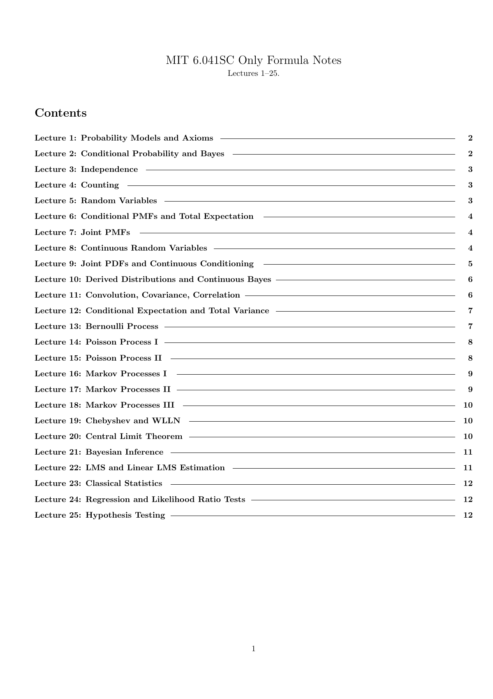
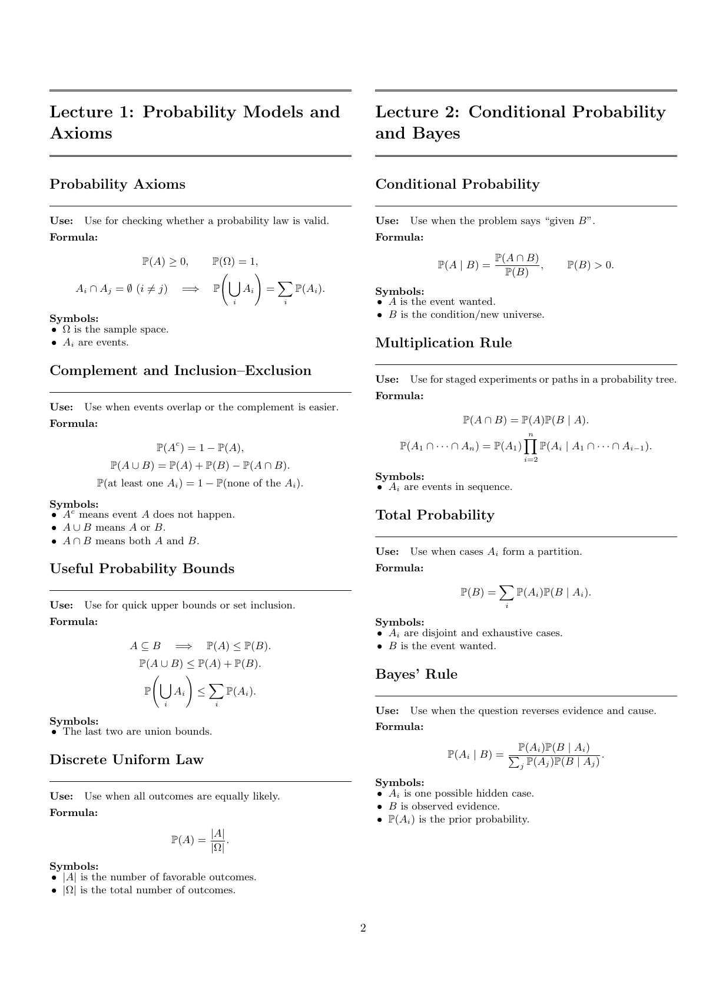
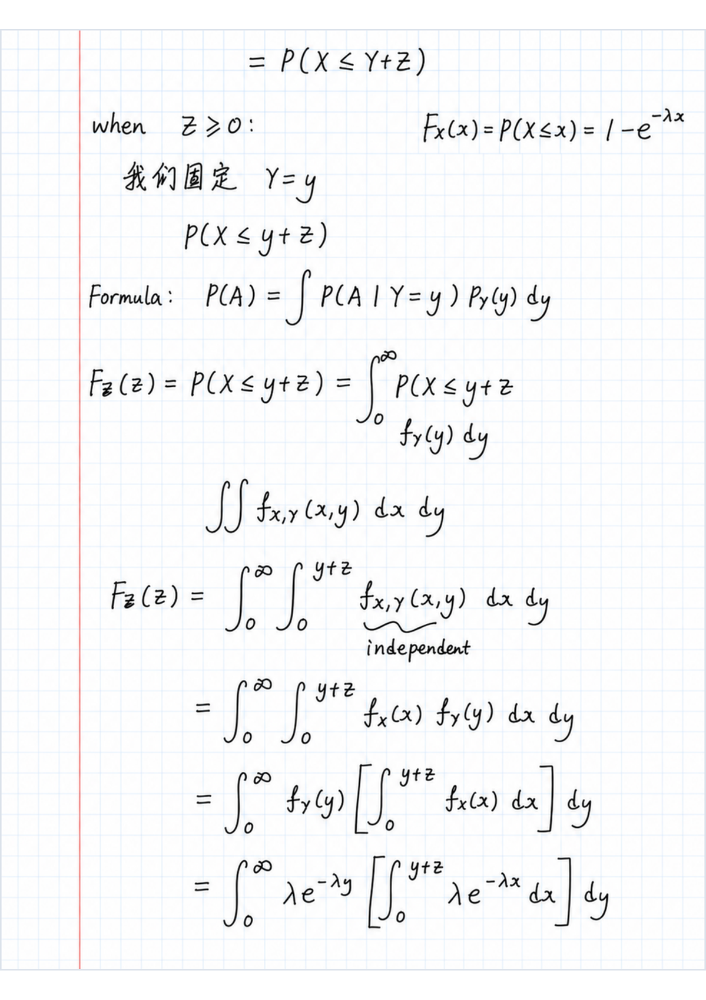

# MIT 6.041SC Formula Sheets and Handwritten Notes

Personal formula sheets and practice notes for MIT OpenCourseWare 6.041SC, **Probabilistic Systems Analysis and Applied Probability**.

This is an unofficial personal study project and is not affiliated with, sponsored by, or endorsed by MIT.

I made these notes while studying the course because I found that there are many formulas, models, and similar-looking situations that are easy to mix up during exam review. The goal is not to create a complete textbook-style reference. Instead, this repository collects my compact formula-only notes and selected recitation practice notes based on my own handwritten work.

## Preview

**Contents**

**Formula sheet**

**Handwritten recitation note**

## Files

- [`mit-6041sc-formula-notes.pdf`](mit-6041sc-formula-notes.pdf): compiled formula-only PDF for Lectures 1-25.
- [`mit-6041sc-formula-notes.tex`](mit-6041sc-formula-notes.tex): editable LaTeX source for the formula-only notes.
- [`handwritten-recitation-notes/`](handwritten-recitation-notes/): PDF versions of selected handwritten recitation notes.

The recitation notes currently include Recitations 4-12, 14, 15, and 17. Some recitations are not included because I do not have a finalized PDF for them yet.

## Important Note About Accuracy

The recitation PDFs were produced from my own handwritten notes and then cleaned up with AI assistance to make them easier to read. They should be treated as personal practice notes, not official solutions.

Please read them carefully:

- the original handwritten notes may contain mistakes;
- the AI cleanup process may introduce transcription or formatting errors;
- my explanations follow my own problem-solving logic and may differ from other valid approaches;
- these notes are meant to support review, not replace the official course material or textbook.

If you use these notes, cross-check formulas, derivations, and final answers against the MIT OCW materials, the textbook, or your own work.

## Scope

The formula-sheet PDF focuses on MIT 6.041SC Lectures 1-25, covering probability models and axioms, conditioning and Bayes' rule, counting, discrete and continuous random variables, expectation and variance, joint distributions, transformations, convolution, covariance, conditional expectation, Bernoulli and Poisson processes, Markov chains, Chebyshev's inequality, WLLN, CLT, Bayesian inference, LMS estimation, classical statistics, regression, likelihood ratio tests, and hypothesis testing. The handwritten recitation notes are selected practice writeups from my study process.

## Course

MIT OpenCourseWare 6.041SC: Probabilistic Systems Analysis and Applied Probability.

The original MIT OpenCourseWare course materials are provided by MIT OCW under the Creative Commons Attribution-NonCommercial-ShareAlike 4.0 International license. This repository is a personal study aid written from my own notes and understanding.

## License

This repository is released under the MIT License.
